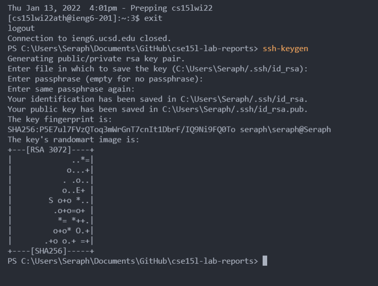

## Installing VScode
Download vscode from the official website


When you open vscode it should look something like this. The themes might be different but you'll see a text editor


---
## Remotely Connecting
 
Open terminal with the bar on the top of vscode


In the terminal we can type `ssh <yourusername@ieng6.ucsd.edu>` to login remotely

Replace yourusername with the personal email or the class header (cs15lwi22ath for cse15 winter 2022)


---
## Trying Some Commands
After logging in, we can try some commands

`ls` lists the items in the current directory\
`cd <directory name>`  can let us move into another directory\
`cat` short for concatenate can view content of a file or create new files


---
## Moving Files with scp
To use scp, we have to exit the remote login first with `exit`\
Find a file to scp in the directory and type `scp <filename> username@ieng6.ucsd.edu:~/`


---
## Setting an SSH Key
To setup ssh key, type `ssh-keygen` on the client\
It will ask for files to save the key and passphrases, and just leave them as default



This will generate a public key and we want to scp this public key into the server too in the .ssh directory\
We need to first make the .ssh directory using `mkdir <name>` then use scp to copy into the .ssh directory

```
scp /Users/Seraph/.ssh/id_rsa.pub cs15lwi22ath@ieng6.ucsd.edu:~/.ssh/authorized_keys
```


---
## Optimizing Remote Running

We can type ssh followed by the command directly to use it without staying in the server interface

For example: `ssh ychao@ieng6.ucsd.edu "ls"` will list the current directory in the server directly


