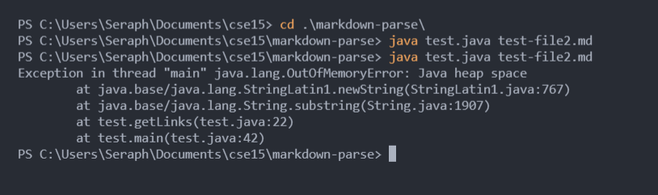
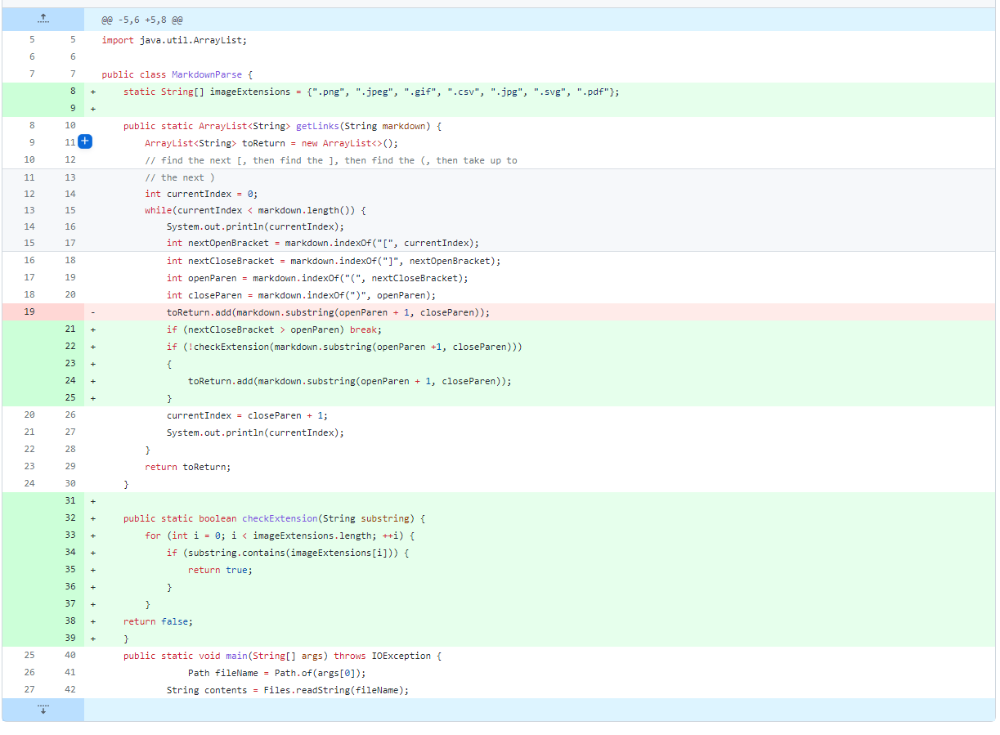
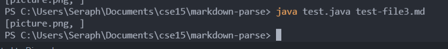
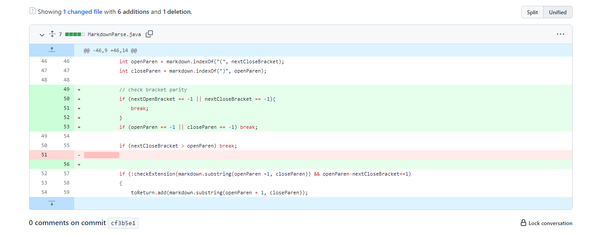
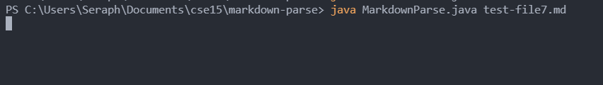

# Code change 1
*Note: the terminal is running test.java instead of MarkdownParse.java because I didn't save pictures of the symptoms before, so I needed a test file to record the outputs using previous versions of code. 
- **Screenshot of github diff**

- **Test file for a failure-inducing input**:\
*[test-file2.md](https://github.com/Seraph27/markdown-parse/blob/cf3b5e17a44db09c0ff8d7aade967b8b0dc6d57e/test-file2.md)*
- **Symptom of the failure-inducing input**\
The code is stuck in an infinite loop until an OutOfMemoryError is thrown. 

- **Explaination**\
The failure-inducing input is `test-file2.md` and the reason it caused the bug in the program is because the order of the bracket and parenthesis is reversed, but the code doesn't check for that so it stuck in the while loop until the memory is full. To fix this, we need to that the index of the closed bracket to be less than the index of the open parenthesis.

# Code change 2

- **Screenshot of github diff**

- **Test file for a failure-inducing input**\
*[test-file3.md](https://github.com/Seraph27/markdown-parse/blob/e991e9907f3b586fbb9db5b46c7b980e0000d69f/test-file3.md)*
- **Symptom of the failure-inducing input**\
Incorrect output of an image when we are expecting website links.

- **Explaination**\
The failure-inducing input is `test-file4.md` and the symptom showed by the failure is an incorrect output of a link. The output is a image file so we should not expect any output. This is a bug in the code because we didn't check for the extensions of the links. To fix this, we added an array of image extensions, and check for the inputs accordingly. 

# Code change 3

- **Screenshot of github diff**

- **Test file for a failure-inducing input**\
*[test-file7.md](https://github.com/Seraph27/markdown-parse/blob/e991e9907f3b586fbb9db5b46c7b980e0000d69f/test-file7.md)*
- **Symptom of the failure-inducing input**\
Stuck in an infinite loop until `CTRL+C` is pressed

- **Explaination**\
The failure-inducing input is `test-file7.md` and the symptom showed an infinite loop that didn't produce a OutOfMemoryError (I assume this is because I didn't leave it there for long enough). This is a bug in the code because even though we checked for the order of the brackets and parenthesis, we didn't check for the pairs of those brackets and parenthesis so it got stuck in the loop. To fix this, we made sure to break out of the loop if we can't find a "pair" of brackets or parenthesis.  
