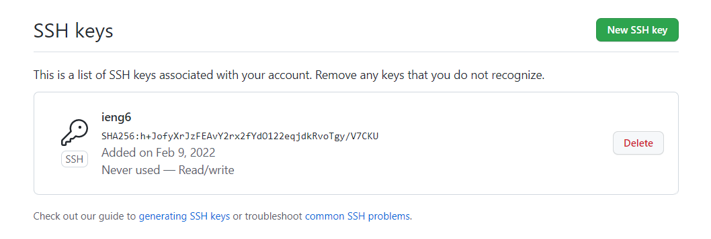
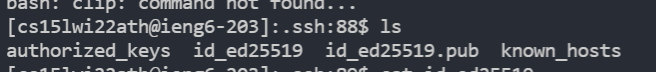
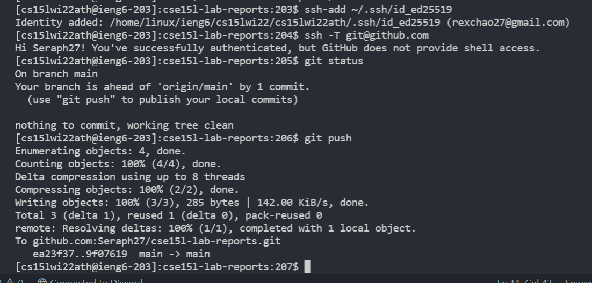

# Setup Github Access from ieng6

* **Show where the public key you made is stored on Github and in your user account (screenshot)**

* **Show where the private key you made is stored on your user account (but not its contents) as a screenshot**\

The private key is stored in `id_ed25519` 

* **Show running git commands to commit and push a change to Github while logged into your ieng6 account**

* **Show a link for the resulting commit**\
[Link to commit](https://github.com/Seraph27/cse15l-lab-reports/commit/9f076192c37fc4cb5613e8dfcabf6d1e236925d9)
