# Snippet 1

> **Expected output of snippet using vscode preview**

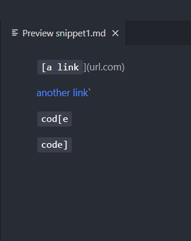
---
> **Turning the output into a junit test**

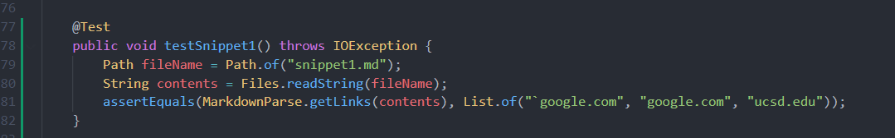
---
> **My (old) implementation did not pass the test**

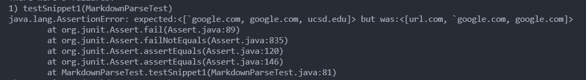
---
> **The reviewed implementation did not pass the test**

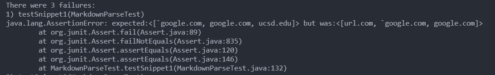

---
# Snippet 2

> **Expected output of snippet using vscode preview**

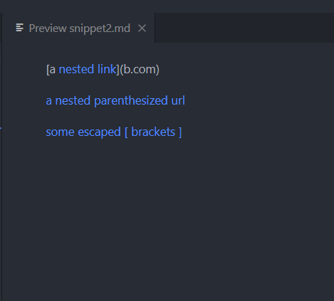

> **Turning the output into a junit test**

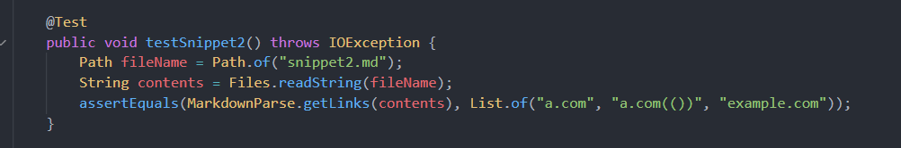

> **My (old) implementation did not pass the test**

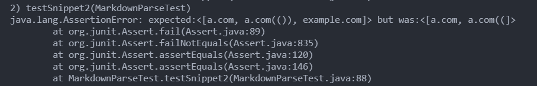

> **The reviewed implementation did not pass the test**

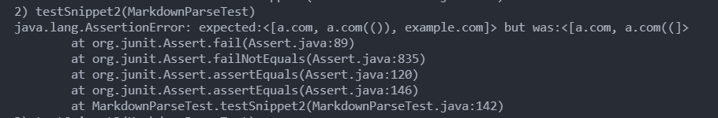
---

# Snippet 3

> **Expected output of snippet using vscode preview**

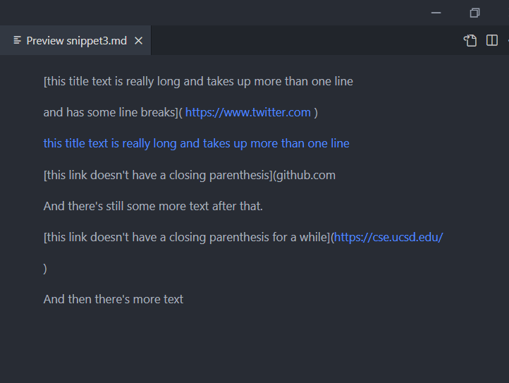

> **Turning the output into a junit test**

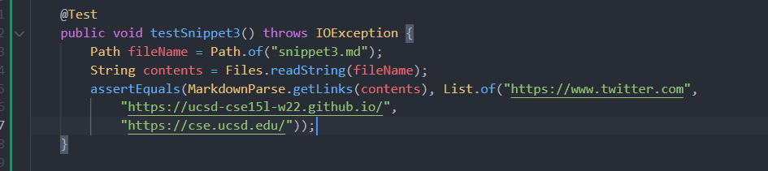

> **My (old) implementation did not pass the test**
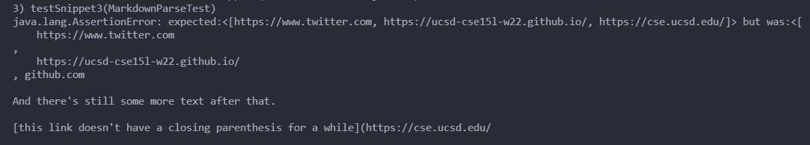

> **The reviewed implementation did not pass the test**
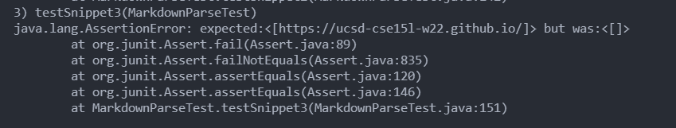

# Questions

* Do you think there is a small (<10 lines) code change that will make your program work for snippet 1 and all related cases that use inline code with backticks? If yes, describe the code change. If not, describe why it would be a more involved change.

The problem with the first snippet is that the markdown format for links which is [] followed by the actual URL in () is messed up because of backticks 
```
`[a link`] (`google.com)`
```
The simple fix would be not outputting anything if the starting or ending brackets are within the backticks

* Do you think there is a small (<10 lines) code change that will make your program work for snippet 2 and all related cases that nest parentheses, brackets, and escaped brackets? If yes, describe the code change. If not, describe why it would be a more involved change.

The second snippet would need a more involved fix to make it work. This is because nested parenthesis, brackets and escaped characters (such as \ followed by a bracket to make the markdown ignore it) all requires different checks independently. This will require more if elses and code blocks that will exceed 10 lines.

* Do you think there is a small (<10 lines) code change that will make your program work for snippet 3 and all related cases that have newlines in brackets and parentheses? If yes, describe the code change. If not, describe why it would be a more involved change.

Snippet 3 is probably difficult to fix within 10 additional lines as well since we need to ignore blank spaces as well as blank lines. This requires handling whitespace properly so that the code and parse line skips, missing parenthesis and multiple line links. Since there's a lot of missing functionality, it probably takes more than 10 lines of code.
