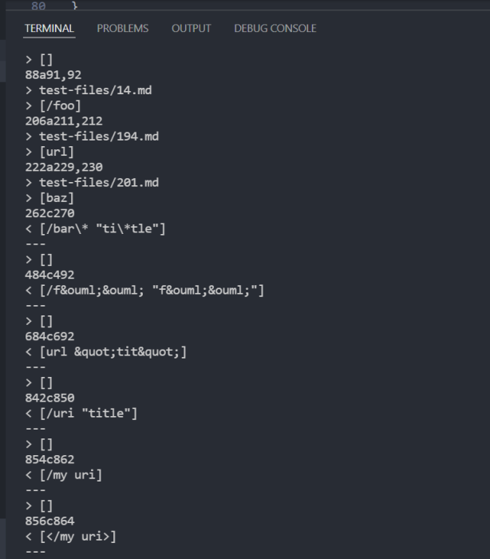
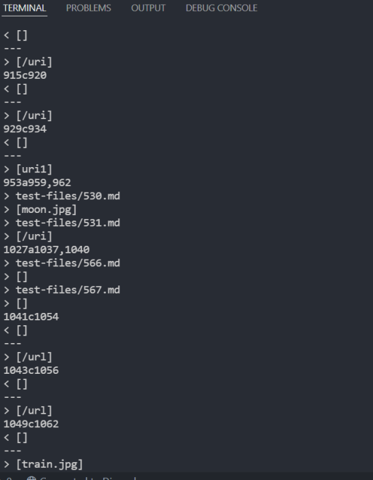
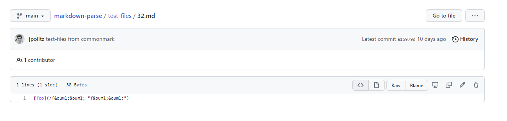
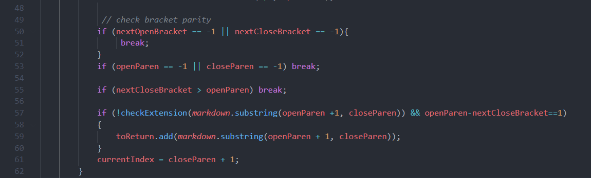
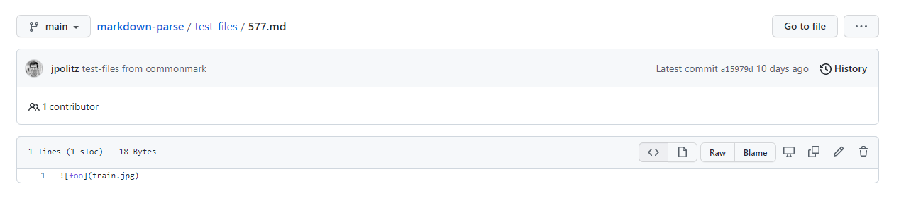
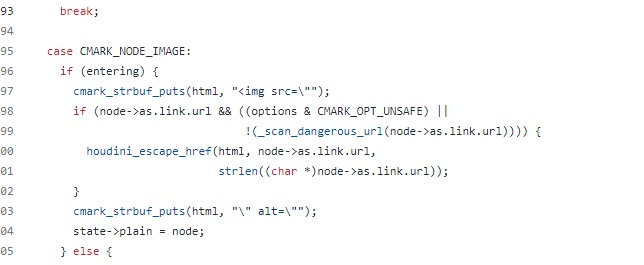

# Using diffs

> How you found the tests with different results (Did you use diff on the results of running a bash for loop? Did you search through manually? Did you use some other programmatic idea?)

For large amounts of tests like this (in this case 1000+ files), it would be unreasonable to search for any file manually because the majority of these md files yield the same outputs. Instead, running scripts and using diff makes things easier to compare at a glance and is more effiecient in general.

## Diff 

Running the command `diff markdown-parse/results.txt group-markdown-parse/results.txt` gives the following results

Note that the lines are slightly different cause I had to rename several files that were just stuck on infinite loops using my group's implementation




# Different Results 1
**Line 482 -> 32.md**

```
484c492
< [/f&ouml;&ouml; "f&ouml;&ouml;"]
---
> []
```


In this case, it is clear that our group's implemented returned a link when it shouldn't. The provided implementation didn't return a link which is correct.

The bug is simply that our code did not take into account weird unicode characters such as 
/f&ouml;&ouml; and
"f&ouml;&ouml;"
and the program just considered is as part of the url. 



To fix this problem, we simply need to add a section of code, preferably a method that checks for weird unicode characters, similiar to how checkExtension() works. On line 57 we can then call this method to make sure the links does not get added in when it contains bad characters. 

# Different Results 2
**Line 1049 -> 577.md**

```
1049c1062
< []
---
> [train.jpg]
```




In this case, I would argue that our code is correct cause a few weeks ago we did an implementation where we are supposed to remove image links (urls with image extensions such as .png & .jpg) cause they don't cound as links. The provided implementation doesn't take that into account.

The bug is simply it returned a .jpg image (which wouldn't be an actual link unless you have the image locally), so the fix would be not returning any links with image extensions behind it.



After digging a bit in the source code of common mark, it seems like they do parse image links, but they do return it into a html img tag. To exclude this particular case, just simply remove this code so image links will not be returned. 
